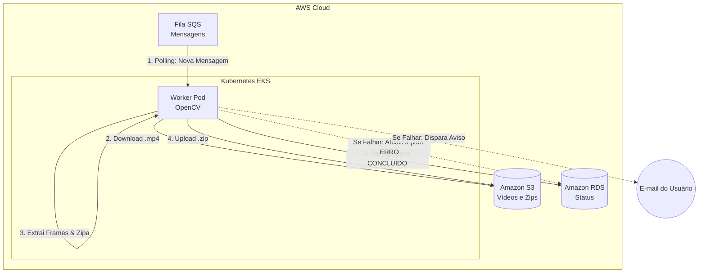

# 🤖 Hackathon Fase 5 - Worker de Processamento (Repo 4 de 5)

Este repositório contém o **Microsserviço Worker (Robô)** do Sistema de Processamento de Vídeos da FIAP. 

Diferente de uma API tradicional, este serviço não possui rotas web nem expõe portas para a internet. Ele atua de forma **assíncrona e em background** (Headless), lendo a fila de mensageria e executando o trabalho pesado de processamento de imagens, garantindo que o sistema seja resiliente a picos de tráfego.

## 🎯 Responsabilidades
- **Polling Assíncrono:** Fica em *Long Polling* escutando a fila **Amazon SQS** em busca de novos vídeos.
- **Processamento (OpenCV):** Faz o download do vídeo do **Amazon S3**, utiliza a biblioteca de Inteligência Artificial *OpenCV* para fatiar o vídeo e extrair 1 frame (imagem) a cada segundo.
- **Compactação:** Reúne todas as imagens extraídas e cria um arquivo `.zip`.
- **Upload e Persistência:** Envia o `.zip` gerado de volta para o S3 e atualiza o status do banco de dados (RDS PostgreSQL) para `CONCLUIDO`.
- **Notificação de Falha:** Caso o vídeo esteja corrompido ou o processamento falhe, altera o status para `ERRO` e envia um e-mail transacional (SMTP) para o usuário.

## 🛠️ Tecnologias Utilizadas
- **Python 3.11**
- **OpenCV (cv2):** Processamento de imagem e vídeo.
- **Boto3:** SDK da AWS para integração com S3 e SQS.
- **Docker:** Containerização com bibliotecas de sistema (`libglib2.0-0`, `libsm6`) exigidas pelo OpenCV.
- **Kubernetes (EKS):** Deployment escalável e autogerenciado.

## 🏛️ Fluxo de Processamento (Saga/Worker)

## 🚀 Como Executar o Deploy
O deploy é automatizado no Kubernetes (EKS) via GitHub Actions.

1. Configure os seguintes **Secrets** no repositório:
   - `AWS_ACCESS_KEY_ID`, `AWS_SECRET_ACCESS_KEY`, `AWS_SESSION_TOKEN`
   - `DB_HOST`, `DB_NAME`, `DB_PORT`, `DB_USER`, `DB_PASSWORD`
   - `S3_BUCKET_NAME` (O output gerado pelo Repo 2 - Infra K8s)
   - `SQS_QUEUE_URL` (O output gerado pelo Repo 2 - Infra K8s)
   - `ECR_REPO_WORKER` (A URL do ECR do Worker, gerada no Repo 2)
   - `EMAIL_OFICINA` e `EMAIL_SENHA_APP` (Credenciais do Gmail para envio de alertas)
2. Faça um push na branch `main` ou acione o workflow manualmente.
3. A pipeline gerará a imagem Docker com as dependências do OpenCV e aplicará o manifesto `deployment.yaml` no cluster.

